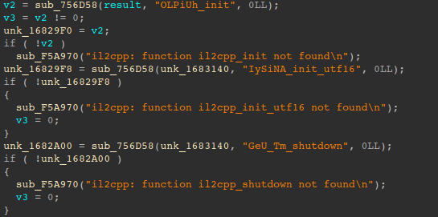
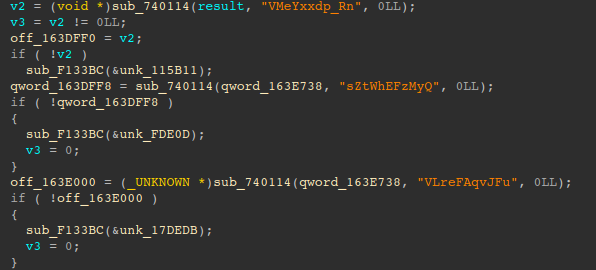
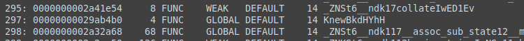
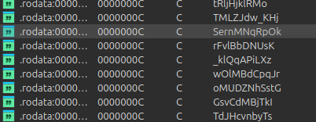

# Finding-Encrypted-Il2Cpp-Symbols
How to find encrypted Il2Cpp symbols for games on Android (probably works for pc as well)

Many games will encrypt their il2cpp symbols, which makes it very hard to interact with the game itself. some games have it easier where they *don't* strip the log for the symbol, as shown here

vs other games that strip those as well, which make it hard to find. As shown here

This python script works on both versions, so how to do it is the same. I will be using IDA-Pro for this, but ghidra is roughly the same process.

To start, open the libunity.so for the target game in your decompiler (if you're using ghidra, wait for it to fully finish analyzing)
To make it easier, you can run llvm-readelf from your Android NDK 
`llvm-readelf -Ws /path/to/libil2cpp.so | grep "FUNC" > ./functions.txt` 
in the functions.txt file, it shouldn't take much scrolling until you find an encrypted symbol. Some games may look like this

copy the symbol's name, search that in the libunity.so file's strings, and double click

if you only want to use the libunity.so file, just go to strings and scroll until you find a symbol. Something like this (may vary per game)

then double click

if should bring you to a screen with the string, there should be only one xref, double click the xref
decompile/get the pseudo code for the function, ctrl+a and ctrl+c the contents, and put that into bad.txt

Now for the next step, you'll need to get the same Unity version's file but without anyhing encrypted, a good github with every version is [MelonLoader.UnityDependencies](https://github.com/LavaGang/MelonLoader.UnityDependencies/releases). I use this and it comes in handy. You may also download the unity version yourself, build for your target device, and get the file from there.

Repeat the same process for the decrypted file, but this time save the pseudo code in good.txt
To finish off, just run `python3 Il2CppSymbolMapMaker.py` and it should do it.